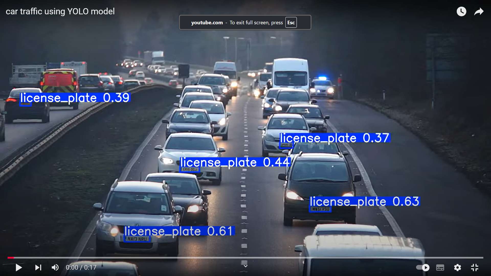

<p align="left"> 

</a> <a href="https://www.python.org" target="_blank" rel="noreferrer">  </a> 
</a> <a href="https://opencv.org/" target="_blank" rel="noreferrer">  </a>


# License Plate Detection using YOLO

This project detects and tracks license plates in real-time using the YOLO object detection model and processes video files. The system is capable of resizing frames for better performance, drawing bounding boxes, and saving the results to an output video.

## Features

- Detects license plates in real-time using a YOLO model.
- Displays bounding boxes around detected license plates.
- Resizes frames to optimize performance.
- Saves the processed video to a file.
- Tracks and avoids re-detecting already recognized license plates using tracking techniques (optional for future updates).

---

## Prerequisites

Ensure you have the following installed:
- Python 3.8+
- Required Python libraries (see `requirements.txt` below).

### Install Dependencies


```
pip install -r requirements.txt
```
# How to Use
## You can use it for real life car plate detection
- Clone the repository:
  ~~~
  git clone https://github.com/VolodymyrKyba/Car_Plate_Reader
  ~~~
- Place your YOLO model weights in the root folder (e.g., best.pt).
- Run the Python script:
  ```
  python live_model.py
  ```
- Add your video file (e.g., car_traffic.avi) to the root folder or specify its path in the script.
- Detected objects and their bounding boxes will be displayed on the video window. Press q to quit the program.

## You can use YOLO model to convert all video or image file
- Place your YOLO model weights in the root folder (e.g., best.pt).
- Run the Python script:
  ~~~
  python video_YOLO_convert.py
  ~~~

[![YouTube]](https://www.youtube.com/watch?v=GgO0FbRGMBA/0.jpg)

# Code Structure
- live_model.py
: The main script that processes the video using the YOLO model.
- requirements.txt: A list of all necessary Python libraries for the project.
- README.md: This documentation file.
- best.pt: YOLO model weights (you must provide your own trained model).
## License
This project is licensed under the MIT License. Feel free to use, modify, and distribute.